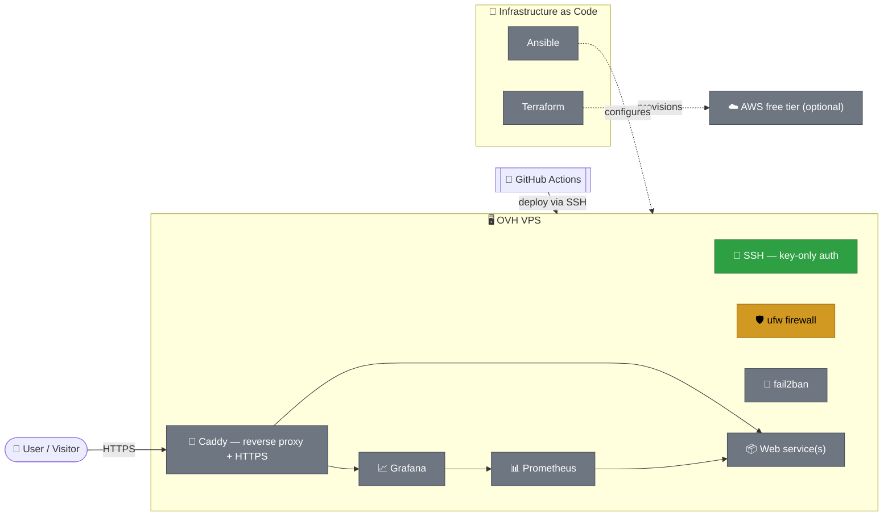

# 🏠 Homelab — Building Secure Infrastructure from Scratch

> A hands-on infrastructure/security/DevOps project built on a real, internet-facing VPS — not an isolated local VM. Every phase is documented with the decisions made, the mistakes hit along the way, and why they were fixed the way they were.

## 🎯 Project Goal

Design, secure, and evolve a complete infrastructure — from a bare server up to container orchestration — applying real production practices: least privilege, infrastructure as code, monitoring, CI/CD.

This repo serves both as a **technical training ground** and as **verifiable proof of skills**: nothing here is simulated. The server is genuinely online, genuinely targeted by bots like any exposed server, and genuinely hardened in response.

## 🗺️ Target Architecture



🟢 Done · 🟡 In progress · ⚪ Planned

## 📋 Roadmap

### Phase 1 — Linux Hardening 🔄 *in progress*
- [x] Audited the system configuration shipped by the hosting provider
- [x] SSH authentication restricted to Ed25519 key pairs only
- [x] `root` login fully disabled over SSH
- [ ] Firewall (`ufw`) — restrict inbound traffic to the strict minimum
- [ ] `fail2ban` — automatic banning of intrusion attempts
- [ ] Automatic updates and general system hygiene

### Phase 2 — Containerization 📌 *planned*
- [ ] Docker & Docker Compose
- [ ] First containerized application service

### Phase 3 — Secure Web Exposure 📌 *planned*
- [ ] Domain name + DNS
- [ ] Caddy reverse proxy + automatic HTTPS certificates

### Phase 4 — CI/CD 📌 *planned*
- [ ] GitHub Actions pipeline: test → build → automatic deployment

### Phase 5 — Observability 📌 *planned*
- [ ] Prometheus (metrics) + Grafana (dashboards)

### Phase 6 — Ansible 📌 *planned*
- [ ] Fully reproducible server configuration, driven from this repo

### Phase 7 — Terraform 📌 *planned*
- [ ] Infrastructure provisioning as code

### Phase 8 — Public Cloud 📌 *optional*
- [ ] Extension to AWS free tier

### Phase 9 — Orchestration 📌 *optional*
- [ ] Lightweight k3s / Kubernetes

## 🛡️ Security Measures Already in Place

| Measure | Status |
|---|---|
| Key-only SSH authentication (no password login) | ✅ |
| `root` login disabled over SSH | ✅ |
| SSH config versioned and independent from auto-generated files (`cloud-init`) | ✅ |
| Active firewall | ⏳ Phase 1.3 |
| Automatic banning of malicious IPs | ⏳ Phase 1.4 |

## 📁 Repo Structure

```
homelab/
├── README.md                          # this file
└── docs/
    └── phase1-ssh-hardening.md        # detailed log: audit, decisions, commands
```

*(structure will grow with each phase: `ansible/`, `terraform/`, `docker/`, etc.)*

## 🧰 Tech Stack (planned)

`Debian 13` · `OpenSSH` · `ufw` · `fail2ban` · `Docker` · `Caddy` · `GitHub Actions` · `Ansible` · `Terraform` · `Prometheus` · `Grafana` · `k3s`

## 📖 Background

This project runs alongside the 42 school curriculum (Born2beRoot, cybersecurity track), with the goal of applying what's learned there in a controlled environment to a real, production-grade setup — and going further, toward a complete and fully documented infrastructure.

---

*Each phase has its own detailed log in `docs/`, with exact commands, pitfalls encountered, and the reasoning behind every technical choice.*
