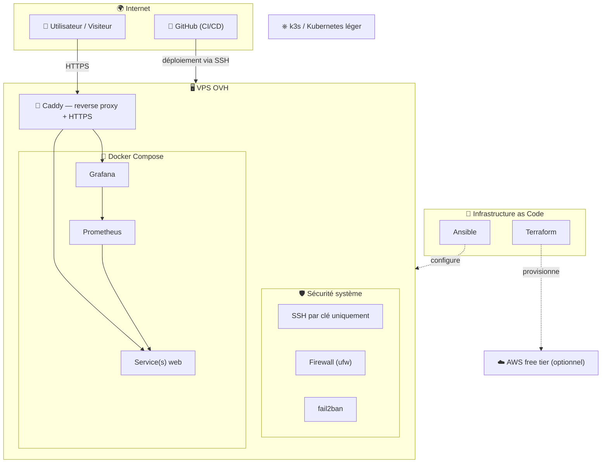

# 🏠 Homelab — Infrastructure sécurisée de A à Z

> Projet personnel de montée en compétences infra/sécurité/DevOps, construit sur un VPS réel exposé sur Internet — pas une VM locale isolée. Chaque phase est documentée avec les décisions prises, les erreurs rencontrées, et pourquoi elles ont été corrigées ainsi.

## 🎯 Objectif du projet

Concevoir, sécuriser et faire évoluer une infrastructure complète — du serveur nu jusqu'à l'orchestration de conteneurs — en appliquant des pratiques de production réelles : moindre privilège, infrastructure as code, monitoring, CI/CD.

Ce repo sert à la fois de **terrain d'entraînement technique** et de **preuve de compétences** vérifiable (rien n'est simulé : le serveur est réellement en ligne, réellement attaqué par des bots comme tout serveur exposé, et réellement durci en réponse).

## 🗺️ Architecture cible



## 📋 Feuille de route

### Phase 1 — Durcissement Linux 🔄 *en cours*
- [x] Audit de la configuration système livrée par l'hébergeur
- [x] Authentification SSH par clé Ed25519 uniquement
- [x] Connexion `root` totalement désactivée en SSH
- [ ] Firewall (`ufw`) — trafic entrant limité au strict nécessaire
- [ ] `fail2ban` — bannissement automatique des tentatives d'intrusion
- [ ] Mises à jour automatiques et hygiène système

### Phase 2 — Conteneurisation 📌 *à venir*
- [ ] Docker & Docker Compose
- [ ] Premier service applicatif conteneurisé

### Phase 3 — Exposition web sécurisée 📌 *à venir*
- [ ] Nom de domaine + DNS
- [ ] Reverse proxy Caddy + certificats HTTPS automatiques

### Phase 4 — CI/CD 📌 *à venir*
- [ ] Pipeline GitHub Actions : test → build → déploiement automatique

### Phase 5 — Observabilité 📌 *à venir*
- [ ] Prometheus (métriques) + Grafana (dashboards)

### Phase 6 — Ansible 📌 *à venir*
- [ ] Configuration du serveur entièrement rejouable depuis ce repo

### Phase 7 — Terraform 📌 *à venir*
- [ ] Provisionnement d'infrastructure as code

### Phase 8 — Cloud public 📌 *optionnel*
- [ ] Extension vers AWS free tier

### Phase 9 — Orchestration 📌 *optionnel*
- [ ] k3s / Kubernetes léger

## 🛡️ Points de sécurité déjà en place

| Mesure | Statut |
|---|---|
| Authentification par clé uniquement (pas de mot de passe SSH) | ✅ |
| Login `root` bloqué en SSH | ✅ |
| Configuration SSH versionnée, indépendante des fichiers auto-générés (`cloud-init`) | ✅ |
| Pare-feu actif | ⏳ Phase 1.3 |
| Bannissement automatique des IP malveillantes | ⏳ Phase 1.4 |

## 📁 Structure du repo

```
homelab/
├── README.md                          # ce fichier
└── docs/
    └── phase1-ssh-hardening.md        # journal détaillé : audit, décisions, commandes
```

*(la structure s'enrichira à chaque phase : `ansible/`, `terraform/`, `docker/`, etc.)*

## 🧰 Stack technique (prévisionnelle)

`Debian 13` · `OpenSSH` · `ufw` · `fail2ban` · `Docker` · `Caddy` · `GitHub Actions` · `Ansible` · `Terraform` · `Prometheus` · `Grafana` · `k3s`

## 📖 Contexte

Projet mené en parallèle du cursus 42 (Born2beRoot, cybersécurité), avec l'objectif d'appliquer en conditions réelles ce qui y est vu en environnement contrôlé — et d'aller au-delà, jusqu'à une infrastructure de production complète et documentée.

---

*Chaque phase possède son propre journal détaillé dans `docs/`, avec les commandes exactes, les pièges rencontrés, et le raisonnement derrière chaque choix technique.*
